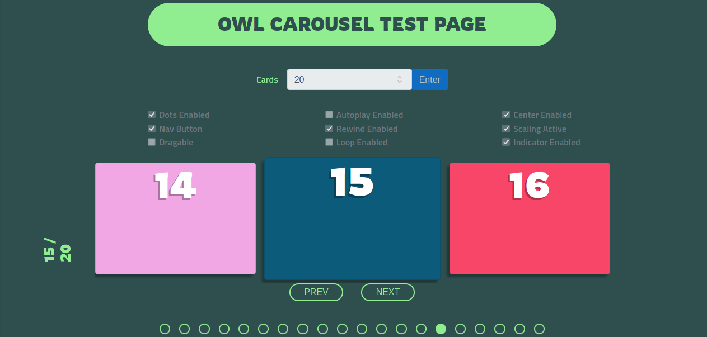

# OWL-Carousel basic test page

This page was performed to make several test over OWL-Carousel plug-in, like getting states, or making severals basic configuration and watching changes in real-time. This app includes bootstrap 4 for layout and format elements, and jquery for programming.

***

## User interface:

  

***

> ## Steps for using interface
> - In Card field, we have tu put a number to give information about many cards we want to show.  
> - Then, we have to check many options to configure next carousel appearing, it is recomended that check at least one option of Dots Enable, Nav Button or Dragable, for make possible to interact with carousel. It is able to select only Autoplay for automatic carousel translate.  
> - When options was checked, we ahve to click on Enter button to create a carousel. Inmediately this will created with random colored cards.  
> - For create another carousel we have to click reload button on the Brpwser to reload app.  

***

## Sources Pages
[jQuery](https://jquery.com/).  
[owl-carousel](https://owlcarousel2.github.io/OwlCarousel2/).  
[Bootstarp 4](https://getbootstrap.com/docs/4.6/getting-started/introduction/).

***

## Pending

* Programing a reset button.  
* Programing possibility to make more simultaneous carousels.  
* Improving UI.  

***

## Licencing

You could use this code if it is useful for any purpose.